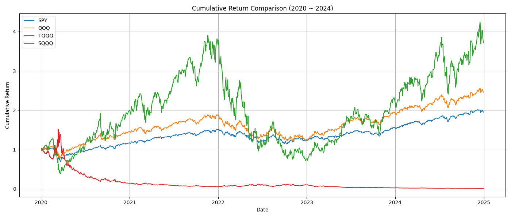
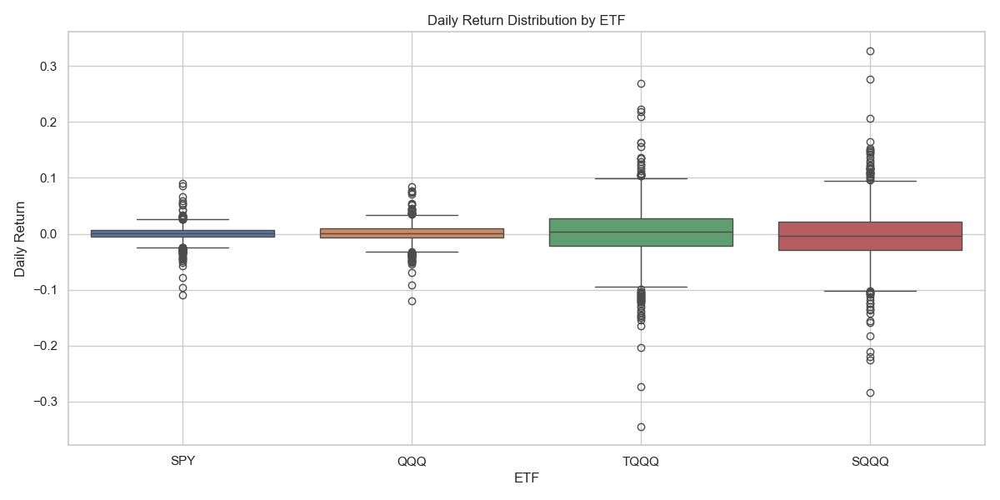

# ETF 비교 분석: SPY vs QQQ vs TQQQ vs SQQQ

이 프로젝트는 대표적인 4가지 ETF(SPY, QQQ, TQQQ, SQQQ)의 과거 데이터를 분석하고,  
누적 수익률, 변동성, 최대 낙폭 등 다양한 수익/위험 지표를 통해 비교하는 분석입니다.

---

## 📊 분석 대상 ETF

| 티커 | 설명                                 |
|------|--------------------------------------|
| SPY  | S&P 500 추종 ETF                     |
| QQQ  | 나스닥 100 추종 ETF                  |
| TQQQ | 나스닥 100 3배 레버리지 상승 ETF     |
| SQQQ | 나스닥 100 3배 레버리지 하락(인버스) ETF |

---

## 📈 누적 수익률 (2020~2024)

2020년부터 2024년까지 각 ETF의 누적 수익률을 비교한 그래프입니다.  
TQQQ는 가장 높은 성장률을 보였지만, 동시에 변동성과 낙폭도 컸습니다.

---

## 📉 리스크 지표 요약

| ETF   | 연평균 수익률(CAGR) | 연간 변동성 | 최대 낙폭 (MDD) |
|-------|----------------------|--------------|------------------|
| SPY   | 14.35%               | 21.00%       | -33.72%          |
| QQQ   | 19.76%               | 25.65%       | -35.12%          |
| TQQQ  | 30.04%               | 75.88%       | -81.66%          |
| SQQQ  | -58.53%              | 76.05%       | -99.27%          |

> 📌 CAGR: 연평균 복리 수익률  
> 📌 변동성: 일일 수익률의 표준편차 × √252  
> 📌 최대 낙폭: 최고점 대비 최저점까지의 손실률

---

## 📦 일일 수익률 분포 (Boxplot)

각 ETF의 일일 수익률 분포를 시각화한 박스플롯입니다.  
레버리지 ETF(TQQQ, SQQQ)는 변동성과 이상치가 뚜렷하게 높습니다.

---

## 🛠 사용 기술

- Python 3.9
- yfinance
- pandas
- matplotlib
- seaborn
- numpy

---

## 💡 분석 인사이트

- TQQQ처럼 레버리지 ETF는 수익률은 높지만 변동성이 매우 큽니다.
- SPY, QQQ는 장기 투자에 더 적합한 안정적인 수익 구조를 보입니다.
- 하락장 베팅용 인버스 ETF(SQQQ)는 장기 투자에 부적합할 수 있습니다.
- 리스크 관리의 중요성을 다시 느낄 수 있는 분석이었습니다.

---

## 📁 주요 파일 설명

| 파일명                        | 설명                                  |
|------------------------------|---------------------------------------|
| `etf_compare.py`             | 메인 분석 코드                         |
| `etf_result_plot.png`        | 누적 수익률 그래프                    |
| `etf_daily_return_boxplot.png` | 일일 수익률 분포 박스플롯           |
| `etf_summary.csv`            | 수익률 지표 요약 (선택)              |
